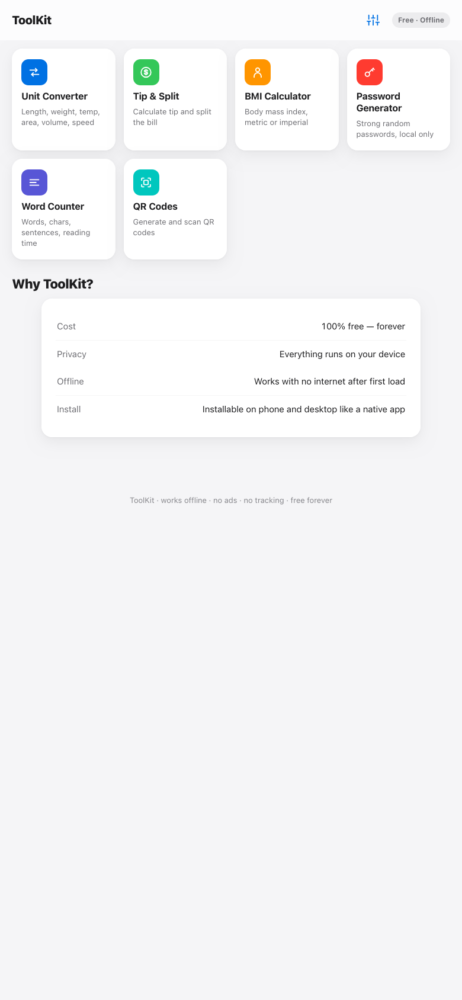
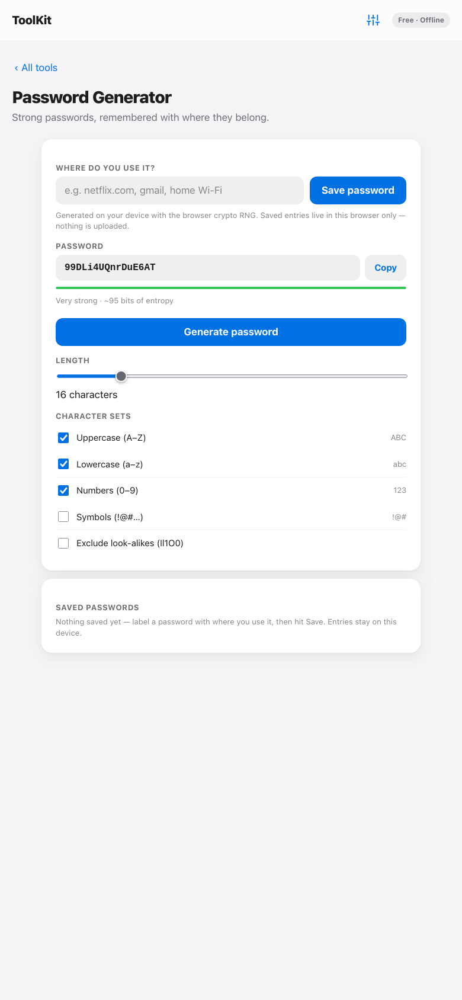
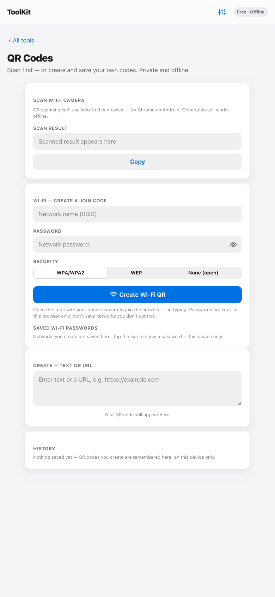
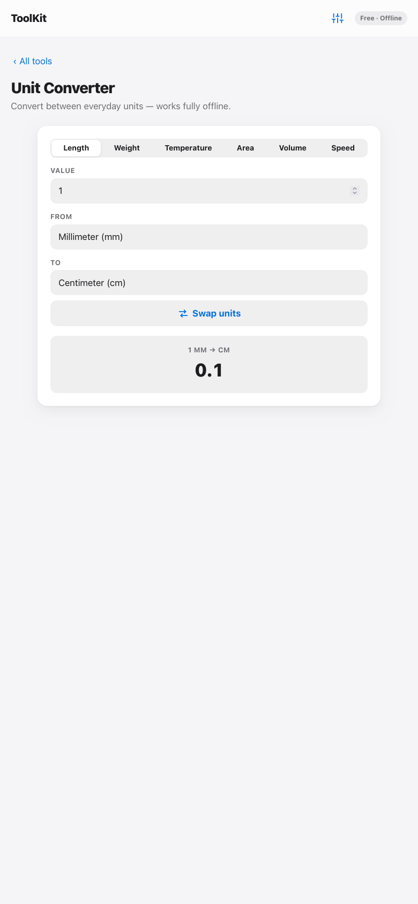
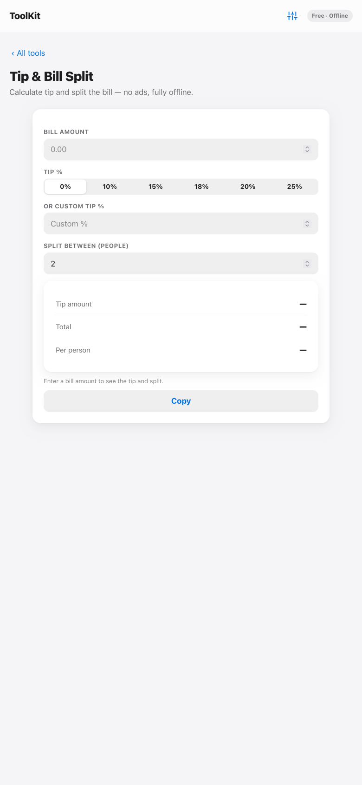
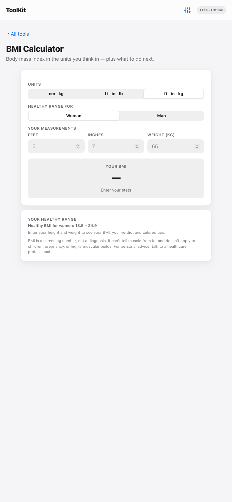

# ToolKit — Everyday Utilities

A free, private, offline-ready PWA with six essential everyday tools. No ads, no accounts, no data collection — everything runs on your device.

**[Launch the web app](https://1ravikafle-glitch.github.io/toolkit-pwa/)** · works on phone and desktop, installable like a native app.

## Install

| Channel | Link | Notes |
| --- | --- | --- |
| Android APK | [Download the latest release](https://github.com/1ravikafle-glitch/toolkit-pwa/releases/latest) | ~290 KB, Android 5.0+, sideload |
| Web (PWA) | [toolkit-pwa](https://1ravikafle-glitch.github.io/toolkit-pwa/) | "Add to Home Screen" |
| F-Droid | Submitted — see [FDROID-SUBMISSION.md](FDROID-SUBMISSION.md) | build metadata + MR instructions |
| IzzyOnDroid | Prepared — see [IZZY-SUBMISSION.md](IZZY-SUBMISSION.md) | pending AI-policy outcome |
| Privacy | [PRIVACY.md](PRIVACY.md) | collects nothing, transmits nothing |

## Screenshots

| Home | Password Generator | QR Codes |
| --- | --- | --- |
|  |  |  |

| Unit Converter | Tip & Split | BMI Calculator |
| --- | --- | --- |
|  |  |  |

## Tools

| Tool | What it does |
| --- | --- |
| Unit Converter | Length, weight, temperature, area, volume, speed |
| Tip & Split | Tip presets (0% default), custom %, per-person split |
| BMI Calculator | Metric / imperial / ft·in·kg, sex-specific healthy ranges, tips |
| Password Generator | Crypto-random, strength meter, save-where-used + photo export |
| Word Counter | Words, chars, sentences, reading time |
| QR Codes | Scan with camera, generate, Wi-Fi join codes, history |

## Highlights

- **Offline-first** — service worker caches everything; works with no internet after first load
- **Installable** — PWA manifest with maskable icon set; "Add to Home Screen" on Android/iOS
- **Light / Dark / System theme** + four text sizes, persisted, no-flash bootstrap
- **Fluid navigation** — spring-based push/pop, 1:1 edge swipe-back with momentum projection, drag-to-dismiss settings drawer
- **Private by design** — saved passwords, QR history and Wi-Fi records never leave the browser (localStorage only)
- **Fast** — QR library lazy-loaded on first open; ~14 KB gzipped main bundle

## Tech

Vite + vanilla TypeScript, zero runtime dependencies beyond the QR codec. Spring physics engine hand-rolled from Apple's *Designing Fluid Interfaces* parameters (damping ratio + response).

## Releases

New versions are one command — bump the version, rebuild web + APK, commit, tag and publish a GitHub release with the APK attached:

```bash
npm run release -- 1.1.0
```

See `scripts/release.sh` for what it does; Android build steps are in `android/`.

## Develop

```bash
npm install
npm run dev        # local dev server
npm run build      # production build → dist/
npm run preview    # serve the production build
```

## Deploy

Static hosting works out of the box (relative asset paths): GitHub Pages, Netlify, Vercel, or any web server — upload `dist/`. This repo deploys to GitHub Pages from the `gh-pages` branch; the latest build is always at the [live URL](https://1ravikafle-glitch.github.io/toolkit-pwa/).

## License

MIT
